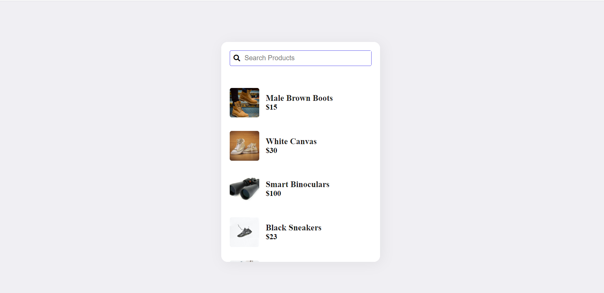

# Product Search Using JavaScript

> In this project I used HTML, CSS & JavaScript to display and search products. I used JavaScript to populate HTML dynamically. 




Additional description about the project and its features.

## Built With

- Major languages
- HTML
- JavaScript
- CSS

## Live Demo

[Live Demo Link](https://mwapsam.github.io/search/)


## Getting Started

**To get a copy of this repo into your local machine run the following command:**

```
git clone https://github.com/Mwapsam/search
cd search
in visual studio code you can click the go live button to view it live in the browser.
```

## Author

👤 **Samuel Chimfwembe**

- GitHub: [@Mwapsam](https://github.com/Mwapsam)

## 🤝 Contributing

Contributions, issues, and feature requests are welcome!
Feel free to check the [issues page](../../issues/).

## Show your support

Give a ⭐️ if you like this project!

## 📝 License

This project is [MIT](./MIT.md) licensed.
